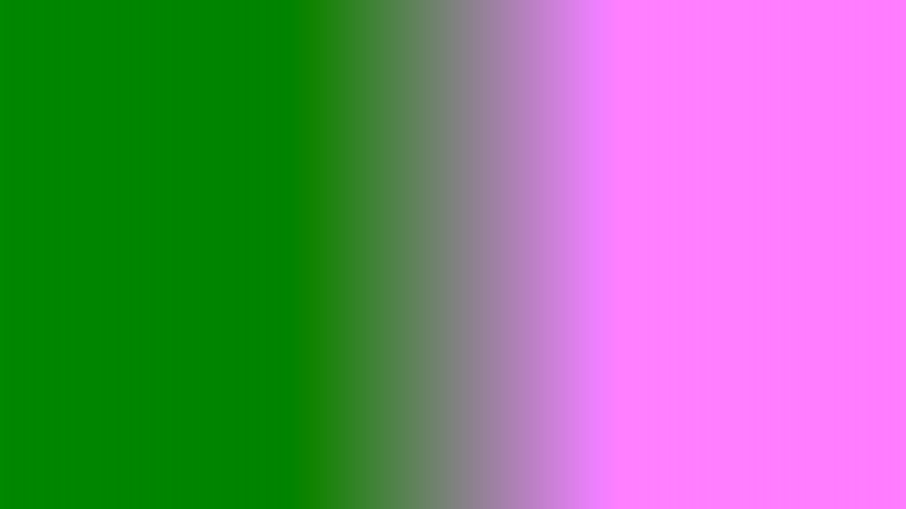
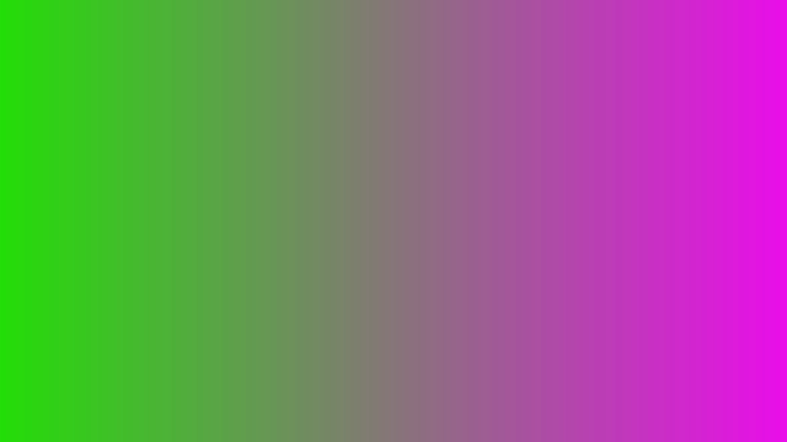

# yuvgrad: A YUV Gradient Generator

By [Chema Gonzalez](https://github.com/chemag), [Johan Blome](https://github.com/JohanBlome), 2019-08-13


# Abstract

This document describes yuvgrad, a tool that generates YUV images with Y, U, and V gradients. We use the tool to test video paths.


# 1. Introduction

This document describes yuvgrad, a tool that generates YUV images with Y, U, and V gradients. We use the tool to test video paths.


# 2. Operation

The tool that produces the YUV gradient images is called `yuvgrad.py`.

By default:

* a 1280x720 image will be created. Values can be changed with `--width` and `--height` CLI options (of an ffmpeg-like `--video_size` CLI option)
* pixel format is yuv420p (aka I420). The tool also supports the nv12 pixel format
* the luma (Y) has a left-to-right gradient, with the `ymin` CLI option at the left side of the image, and `ymax - 1` at the right side of the image.
* the first chroma (U) has a top-to-bottom gradient, with the `umin` CLI option at the top side of the image, and `umax - 1` at the bottom side of the image.
* the second chroma (V) has a bottom-to-top gradient, with the `umax - 1` CLI option at the top side of the image, and `umin` at the bottom side of the image.


Example 1: create a grayscale gradient (all chroma values are 127, luma gradient is left-to-right)

```
$ ./yuvgrad.py -o /tmp/gray.yuv420p.yuv
$ ffmpeg -f rawvideo -pixel_format yuv420p -video_size 1280x720 -i /tmp/gray.yuv420p.yuv /tmp/out.yuv420p.grey.yuv.png
```


Example 2: create a color gradient (luma gradient is left-to-right, U gradient is top-down, V gradient is bottom-up. Output pixel format is nv12 now.

```
$ ./yuvgrad.py --umin 0 --umax 256 --vmin 0 --vmax 256 --pix_fmt nv12 -o /tmp/color.yuv420p.yuv
$ ffmpeg -f rawvideo -pixel_format nv12 -video_size 1280x720 -i /tmp/color.nv12.yuv /tmp/out.nv12.yuv.png
```


Example 3: create a nv12 color gradient (luma gradient is left-to-right, U gradient  is top-down, V gradient is bottom-up)

```
$ ./yuvgrad.py --umin 0 --umax 256 --vmin 0 --vmax 256 --pix_fmt nv12 -o color.nv12.yuv
$ ffmpeg -f rawvideo -pixel_format nv12 -video_size 1280x720 -i color.nv12.yuv color.nv12.yuv.png
```


Example 4: create a nv12 `color_eee` gradient (Y, U, and V gradients are left-to-right).

```
$ ./yuvgrad.py --color --pix_fmt nv12 --ygrad E --ugrad E --vgrad E -o color_eee.nv12.yuv
$ ffmpeg -f rawvideo -pixel_format nv12 -video_size 1280x720 -i color_eee.nv12.yuv color_eee.nv12.yuv.png
```


Example 5: create a nv12, full-range, SDTV.UV gradient (Y, U, and V gradients are left-to-right, covering the YUV cube for SDTV (bt.601) color)

```
$ ./yuvgrad.py --pix_fmt nv12 --predefined sdtv.uv -o /tmp/sdtv.uv.nv12.fr.yuv
$ ffmpeg -f rawvideo -pixel_format nv12 -video_size 1280x720 -i /tmp/sdtv.uv.nv12.fr.yuv image/sdtv.uv.nv12.fr.yuv.png
```


The results are as follows: 


Figure 1 shows the grayscale image. Actual yuv images can be found here ([gray.nv12.fr.yuv](image/gray.nv12.fr.yuv), [gray.yuv420p.fr.yuv](image/gray.yuv420p.fr.yuv), [gray.nv12.lr.yuv](image/gray.nv12.lr.yuv), [gray.yuv420p.lr.yuv](image/gray.yuv420p.lr.yuv))


Figure 2 shows the color image. Actual yuv images can be found here ([color.nv12.fr.yuv](image/color.nv12.fr.yuv), [color.yuv420p.fr.yuv](image/color.yuv420p.fr.yuv), [color.nv12.lr.yuv](image/color.nv12.lr.yuv), [color.yuv420p.lr.yuv](image/color.yuv420p.lr.yuv))



Figure 3 shows the color_eee image. Actual yuv images can be found here ([color_eee.nv12.fr.yuv](image/color_eee.nv12.fr.yuv), [color_eee.yuv420p.fr.yuv](image/color_eee.yuv420p.fr.yuv), [color_eee.nv12.lr.yuv](image/color_eee.nv12.lr.yuv), [color_eee.yuv420p.lr.yuv](image/color_eee.yuv420p.lr.yuv)).



Figure 4 shows the sdtv.uv image. Actual yuv images can be found here ([sdtv.uv.nv12.fr.yuv](image/sdtv.uv.nv12.fr.yuv), [sdtv.uv.yuv420p.fr.yuv](image/sdtv.uv.yuv420p.fr.yuv), [sdtv.uv.nv12.lr.yuv](image/sdtv.uv.nv12.lr.yuv), [sdtv.uv.yuv420p.lr.yuv](image/sdtv.uv.yuv420p.lr.yuv))


# 3. References

* [yuvtools: A YUV Tool Package](README.md)
* [On RGB/YUV Conversions](conversions.md)

